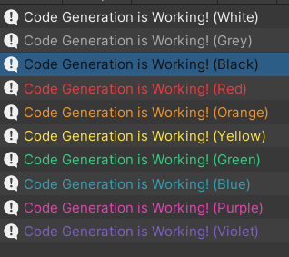

## C# code generation using C# code

## Example:

### Side-by-side comparison of the generator code and the generated code:

<table style="width:100%">
<tr><th style="width: 50%"> Generator code </th> <th> Generated code </th></tr>
<tr><td>

```csharp
var b = CodeBuilder.CreateDefaultBuilder();
```

</td><td></td></tr>

<tr>
<td>

```csharp
b.Namespace.Name("Generated").Body(() => {
    b.Public.Static.Class.Name("MyClass").Body(() => {
    }).Br();

    b.Internal.Enum.Name("MyEnum").Body(Enum => {
        Enum.DefaultMember();
        Enum.Member("NotDefault");
    }).Br();

    b.Public.Interface.Name("IInterface").Body(() => {
    }).Br();

    b.Public.Class.Name("SpecialClass").Inherit("IInterface").Body(() => {
    });
});
```

</td><td>

```csharp
namespace Generated {
    public static class MyClass {
    }

    internal enum MyEnum {
        Default,
        NotDefault,
    }

    public interface IInterface {
    }

    public class SpecialClass : IInterface {
    }
}
```

</td></tr>
</table>

---

## More complex example:

### Generator code:

```csharp
// Some data to the generation method
private static readonly List<(string name, string trim, string uColor, string hexColor)> ColorFields
                  = new List<(string name, string trim, string uColor, string hexColor)> {
    ("White", " ", "new Color(0.93f, 0.93f, 0.93f)", "#eeeeee"),
    ("Grey", "  ", "new Color(0.67f, 0.67f, 0.67f)", "#aaaaaa"),
    ("Black", " ", "new Color(0.07f, 0.07f, 0.07f)", "#111111"),
    ("Red", "   ", "new Color(0.93f, 0.23f, 0.25f)", "#EC3A41"),
    ("Orange", "", "new Color(0.93f, 0.59f, 0.18f)", "#ED962F"),
    ("Yellow", "", "new Color(1f,    0.89f, 0.26f)", "#FFE443"),
    ("Green", " ", "new Color(0.22f,  0.8f,  0.5f)", "#39CD7F"),
    ("Blue", "  ", "new Color(0.19f, 0.63f, 0.69f)", "#30a0b0"),
    ("Purple", "", "new Color(0.89f, 0.27f, 0.69f)", "#E245B0"),
    ("Violet", "", "new Color(0.49f, 0.38f, 0.76f)", "#7d60c3"),
};
```

```csharp
var b = CodeBuilder.CreateDefaultBuilder();
```

```csharp
b.Header(nameof(ColorPaletteGenerator)).Br(); // Will add a header at the top of a file

b.Using("UnityEditor");      // Using UnityEditor namespace to get MenuItem Attribute
b.Using("UnityEngine").Br(); // Using UnityEngine namespace to get Color and Debug.Log()

// Namespace's content won't be indented, that is just my preference. Currently it is not configurable.
b.Namespace.Name("Generated").Body(() => {

    b.Summary("Class that contains different variations of a color");
    b.Public.Class.Name("NeatColor").Body(() => {

        b.Public.Property.Returns("Color").Name("UColor").GetPrivateSet();
        b.Public.Property.Returns("string").Name("HexColor").GetPrivateSet();

        // Constructor: (currently auto-generation of constructors is not supported)
        // b.Self means get current block, it also implements implicit cast to string, so here it will give class name
        b.Public.Method.Name(b.Self).Params(("Color", "uColor"), ("string", "hexColor")).Body(() => {
            b.Writeln("UColor = uColor;");
            b.Writeln("HexColor = hexColor;");
        });
    }).Br();

    b.Summary("Class that contains generated colors");
    b.Public.Partial.Class.Name("ColorPalette").Body(() => {
        foreach (var field in ColorFields)
            b.Public.Property.Returns("NeatColor").Name(field.name + field.trim)
             .Get($"new NeatColor({field.uColor}, \"{field.hexColor})\")");
    }).Br();

    b.Summary("Class with a method that logs all generated colors to the unity console");
    b.Public.Static.Class.Name("ColorPaletteLogger").Body(() => {
        b.Writeln("[MenuItem(\"Plugins/*Generated/Log Generated Colors\")]"); // Just a way to call this method from Unity Editor
        b.Public.Static.Method.Returns().Name("Log").Params().Body(() => {
            foreach (var field in ColorFields)
                b.Writeln($"Debug.Log(\"<color={field.hexColor}>Code Generation is Working! ({field.name})</color>\");");
        });
    });

});
```

### Generates:

```csharp
//--------------------------------------------------------------------------------------
// This file is generated. Modifications to this file won't be saved.
// Creation time: 2022-08-26 19:19:10
// If you want to make any permanent changes, go to the class ColorPaletteGenerator
// At: ???
//--------------------------------------------------------------------------------------

using UnityEditor;
using UnityEngine;

namespace Generated {
    /// <summary> Class that will contain different variations of colors </summary>
    public class NeatColor {
        public Color UColor { get; private set; }
        public string HexColor { get; private set; }
        public NeatColor(Color uColor, string hexColor) {
            UColor = uColor;
            HexColor = hexColor;
        }
    }

    /// <summary> Class that contains generated colors</summary>
    public partial class ColorPalette {
        public NeatColor White  { get; } = new NeatColor(new Color(0.93f, 0.93f, 0.93f), "#eeeeee)");
        public NeatColor Grey   { get; } = new NeatColor(new Color(0.67f, 0.67f, 0.67f), "#aaaaaa)");
        public NeatColor Black  { get; } = new NeatColor(new Color(0.07f, 0.07f, 0.07f), "#111111)");
        public NeatColor Red    { get; } = new NeatColor(new Color(0.93f, 0.23f, 0.25f), "#EC3A41)");
        public NeatColor Orange { get; } = new NeatColor(new Color(0.93f, 0.59f, 0.18f), "#ED962F)");
        public NeatColor Yellow { get; } = new NeatColor(new Color(1f,    0.89f, 0.26f), "#FFE443)");
        public NeatColor Green  { get; } = new NeatColor(new Color(0.22f,  0.8f,  0.5f), "#39CD7F)");
        public NeatColor Blue   { get; } = new NeatColor(new Color(0.19f, 0.63f, 0.69f), "#30a0b0)");
        public NeatColor Purple { get; } = new NeatColor(new Color(0.89f, 0.27f, 0.69f), "#E245B0)");
        public NeatColor Violet { get; } = new NeatColor(new Color(0.49f, 0.38f, 0.76f), "#7d60c3)");
    }

    /// <summary> Class with a method that logs all generated colors to the unity console </summary>
    public static class ColorPaletteLogger {
        [MenuItem("Plugins/*Generated/Log Generated Colors")]
        public static void Log() {
            Debug.Log("<color=#eeeeee>Code Generation is Working! (White)</color>");
            Debug.Log("<color=#aaaaaa>Code Generation is Working! (Grey)</color>");
            Debug.Log("<color=#111111>Code Generation is Working! (Black)</color>");
            Debug.Log("<color=#EC3A41>Code Generation is Working! (Red)</color>");
            Debug.Log("<color=#ED962F>Code Generation is Working! (Orange)</color>");
            Debug.Log("<color=#FFE443>Code Generation is Working! (Yellow)</color>");
            Debug.Log("<color=#39CD7F>Code Generation is Working! (Green)</color>");
            Debug.Log("<color=#30a0b0>Code Generation is Working! (Blue)</color>");
            Debug.Log("<color=#E245B0>Code Generation is Working! (Purple)</color>");
            Debug.Log("<color=#7d60c3>Code Generation is Working! (Violet)</color>");
        }
    }
}
```

### And the console in Unity shows:


