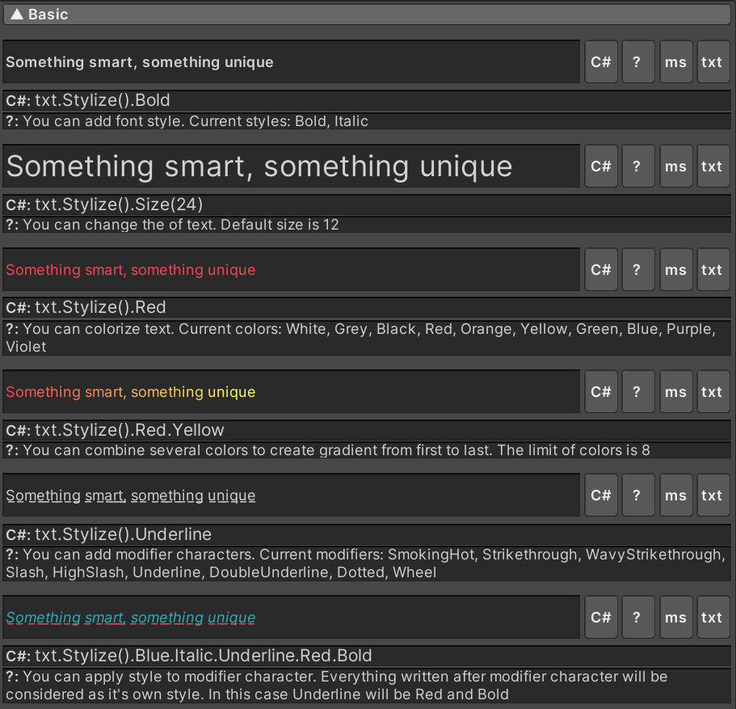
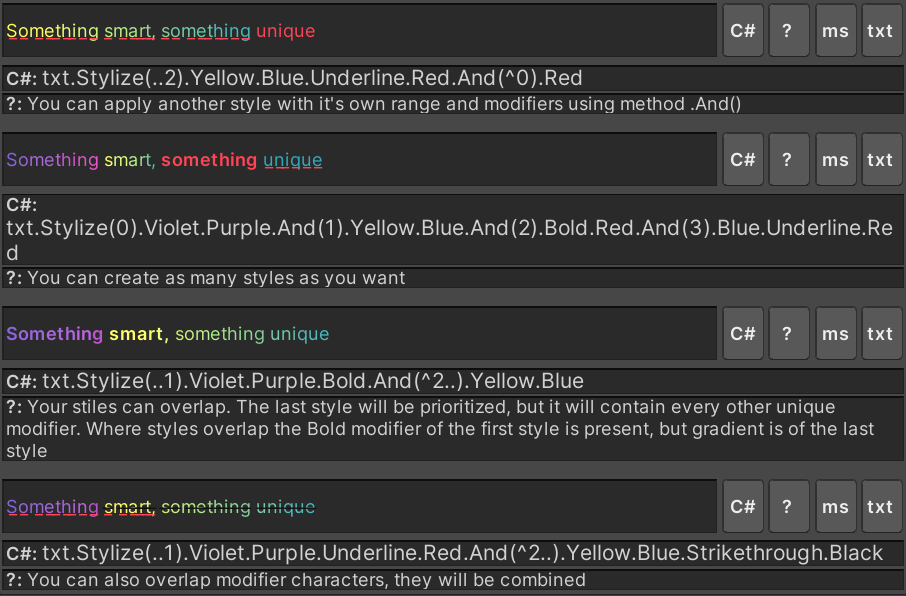
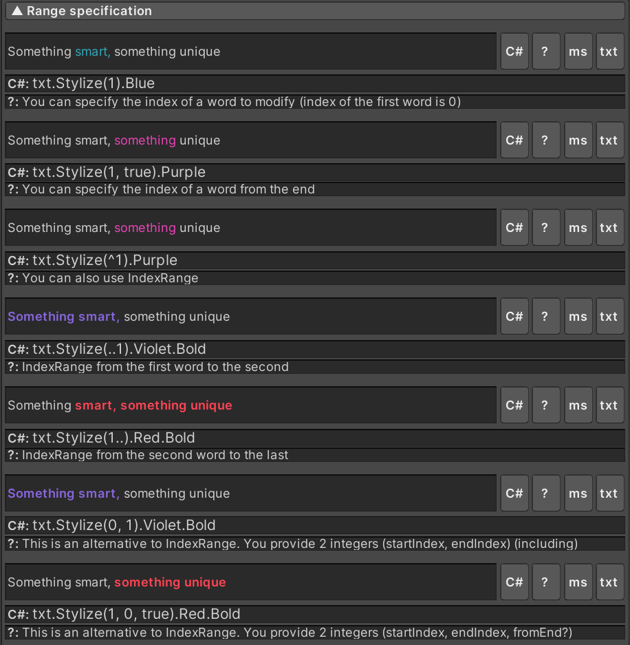
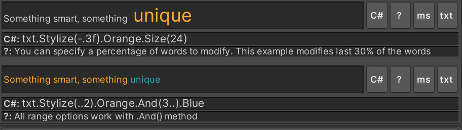
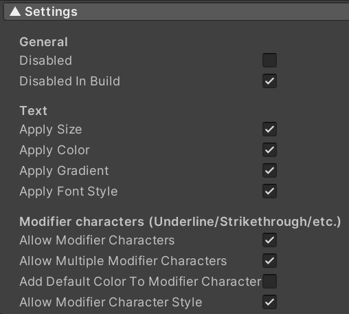
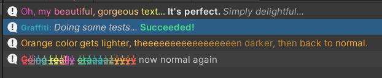
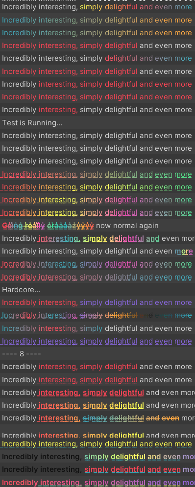

# Graffiti - Rich Text for Unity using Html Tags

#### It's a small project, made mostly for fun

This projects allows you to modify string using html tags and 
modifier characters like Underline, Strikethrough. 

It also supports gradients and multiple styles on the same string. 
There is an option to specify the range of modification for each style. 

So, for example, one style can colorize first half of a string and the second 
one can add underline to the rest of a string. 

All html colors are of short hex format (#RGB)

### Basics

  
Examples, Code and Description

### Range specification

  
Examples, Code and Description

### Available settings

  
Settings

### Other Examples

  
Other

### How to download

Create new Unity project and clone this repository to <b>Assets/Plugins/</b> folder 
To see what it can do go to <b>Assets/Plugins/Graffiti/Resources</b> folder 
And select ScriptableObject <b>"Graffiti Settings"</b>. It contains all examples tests. 
There are several test scripts in <b>Graffiti/Scripts/Tests</b> that

Be warned! This project was not tested and it contains huge amount of bugs, but it works.

### Summary

There is not much use to it in it's current state. 
It's not optimized, it can't perform complex selection operations, 
so you need to specify modification range using IndexRange or by index of a word. 
It also has some bugs when modifier characters with gradient overlap. 

I wanted to utilize Unity console html support to it's limits and I think I succeeded.
